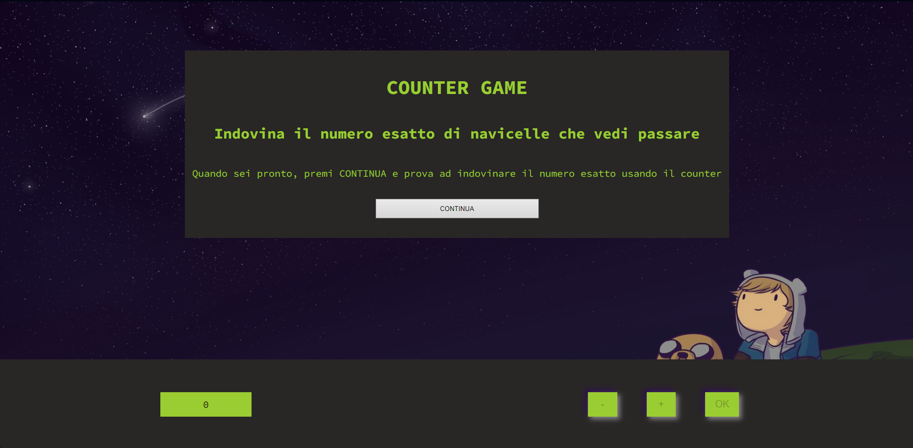

# Counter Game

Benvenuto al Counter Game! Questo è un semplice gioco web in cui devi indovinare il numero esatto di "navicelle" che passano.

---

## Come giocare

1. Premi il pulsante "CONTINUA" per iniziare il gioco.
2. Utilizza i pulsanti "+" e "-" per indovinare il numero di navicelle.
3. Quando pensi di aver indovinato, premi il pulsante "OK" per confermare.
4. Riceverai un messaggio che indica se hai indovinato correttamente o meno.

---

## Tecnologie utilizzate

- HTML
- CSS
- JavaScript

---

## Struttura progetto

- index.html: contiene la struttura html del gioco;
- assets/css/styles.css: file css per gli stili;
- assets/js/script.js: file Javascript per la logica del gioco;
- assets/img/: cartella contenente l'immagine di sfondo del gioco.

---

## Come eseguire il gioco

> Clona questo repository sul tuo computer:
  gh repo clone Federico-Gz/progetto-javscript-basics
> Vai alla pagina del gioco:
  https://js-basics-a9e4b.web.app/
